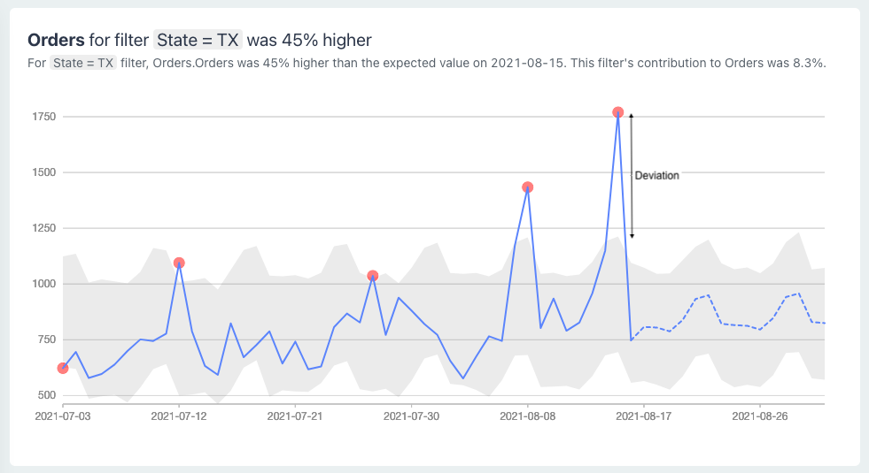

# Anomaly Definitions

You can define one or more anomaly detection jobs on a dataset. The anomaly detection job can monitor a measure at an aggregate level or split the measure by a dimension.

To define an anomaly job, you 

1. Select a dataset
2. Select a measure from the dataset
3. Select a dimension to split the measure _(optional)_
4. Select an anomaly rule

## Split Measure by Dimension

`Measure` \[`Dimension` `Limit` ] \[`High/Low`]

To split a measure by a dimension, select the dimension and then limit the number of unique dimension values you want to split into.

Choose the optional **High/Low** to detect only one type of anomalies. Choose **High** for an increase in measure or **Low** for a drop in measure.

### Limit Dimension Values

When you split a measure by a dimension, you must limit the number of unique dimension values. There are 3 ways to limit - **Top N**, **Min % Contribution**, and **Min Avg Value**.

#### Top N

Top N limits the number of dimension values based on the dimension value's contribution to the measure.

Say you want to monitor Orders measure. But you want to monitor it for your top 10 states only. You would then define anomaly something like below:

#### Min % Contribution

Minimum % Contribution limits the number of dimension values based on the dimension value's contribution to the measure.

Say you want to monitor Orders measure for every state that contributed at least 2% to the total Orders, your anomaly definition would look something like below:

#### Min Avg Value

Minimum Average Value limits the number of dimension values based on the measure's average value.

In the example above, only states where _average(Orders) >= 10_ will be selected. If your granularity is daily, this means daily average orders. If your granularity is hourly, this means hourly average orders.

## Anomaly Detection Algorithms

CueObserve offers the following algorithms for anomaly detection.

1. Prophet
2. Percentage Change
3. Lifetime High/Low
4. Value Threshold

### Prophet

This algorithm uses the open-source [Prophet](https://github.com/facebook/prophet) procedure to generate a forecast for the timeseries. It then compares the actual value with the forecasted value. If the actual value is outside the forecast's confidence range (_grey band in the image below_), it marks the actual value as an anomalous data point.

The metric's percentage deviation (_45% in the image below_) is calculated with respect to the threshold of the forecast's confidence range.

### Percentage Change

This algorithm compares the metric's actual value with its previous value in the timeseries. For example, for a timeseries with daily granularity, it will compare the value on 15th August with the value on 14th August.

If the percentage change is higher than the specified threshold, it marks the recent value as an anomalous data point.

### Lifetime High/Low

This algorithm finds the metric's highest and lowest values in the timeseries. It marks these data points as anomalous data points.

### Value Threshold

This algorithm identifies anomalous data points in the timeseries as per the mathematical rule specified in the anomaly definition screen. Below are a few sample rules:

_Anomaly when Value greater than `X`_

_Anomaly when Value not between `X` and `Y`_

__

