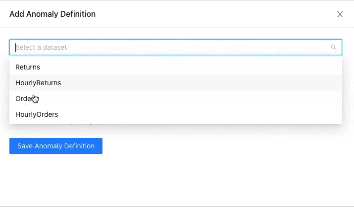

# Anomaly Definitions

You can define one or more anomaly detection jobs on a dataset. The anomaly detection job can monitor a measure at an aggregate level or split the measure by a dimension.

## Define Anomaly

`Measure` \[`Dimension` `Limit` \] \[`High/Low`\]

To split a measure by a dimension, select the dimension and then limit the number of unique dimension values you want to split into.

Choose the optional **High/Low** to detect only one type of anomalies. Choose **High** for an increase in measure or **Low** for a drop in measure.

### Limiting Dimension Values

When you split a measure by a dimension, you must limit the number of unique dimension values. There are 3 ways to limit - **Top N**, **Min % Contribution**, and **Min Value**.

#### Top N

Top N limits the number of dimension values based on the dimension value's contribution to the measure.

Say you want to monitor ReturnEntries measure. But you want to monitor it for your top 35 delivery regions only. You would then define anomaly something like below:

#### Min % Contribution

Minimum % Contribution limits the number of dimension values based on the dimension value's contribution to the measure.

Say you want to monitor ReturnEntries measure for every delivery region that contributed at least 2% to the total ReturnEntries, your anomaly definition would look something like below:

#### Min Value

Minimum Value limits the number of dimension values based on the measure's average value.

In the example above, only delivery regions where _average\(ReturnEntries\) &gt;= 10_ will be selected. If your granularity is daily, this means daily average return entries. If your granularity is hourly, this means hourly average return entries.

