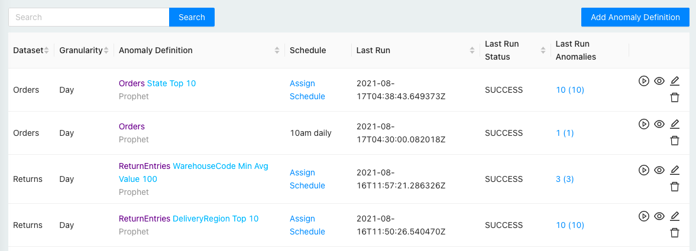

# Getting Started

## Install via Docker-Compose

```
wget https://raw.githubusercontent.com/cuebook/CueObserve/latest_release/docker-compose.yml -q -O cueobserve-docker-compose.yml
docker-compose -f cueobserve-docker-compose.yml up -d
```

**Development Mode:**

```
docker-compose -f docker-compose-dev.yml up -d
```

**OR Production Mode:**

```
docker-compose up -d
```

**OR** Install via Docker **(Deprecated Method)**

```
docker run -p 3000:3000 cuebook/cueobserve
```

Now visit [localhost:3000](http://localhost:3000) in your browser. 

## Add Connection

Go to the Connections screen to create a connection.

.png>)

## Add Dataset

Next, create a dataset using your connection. See [Datasets](datasets.md) for details.

## Define and Run Anomaly job

Create an anomaly detection job on your dataset. See [Anomaly Definitions](anomaly-definitions.md) for details.

Once you have created an anomaly job, click on the \`Run\` icon button to trigger the anomaly job. It might take a few seconds for the job to execute.



Once the job is successful, go to the Anomalies screen to view your anomalies.
