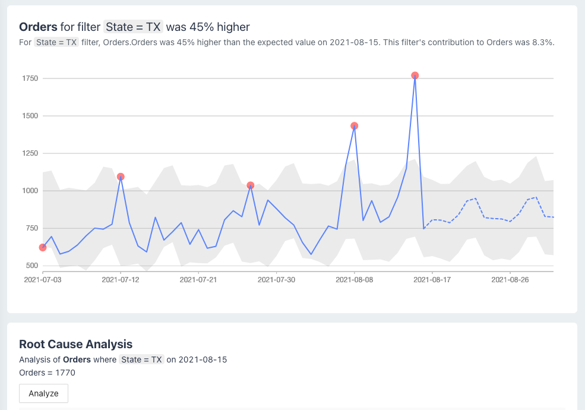
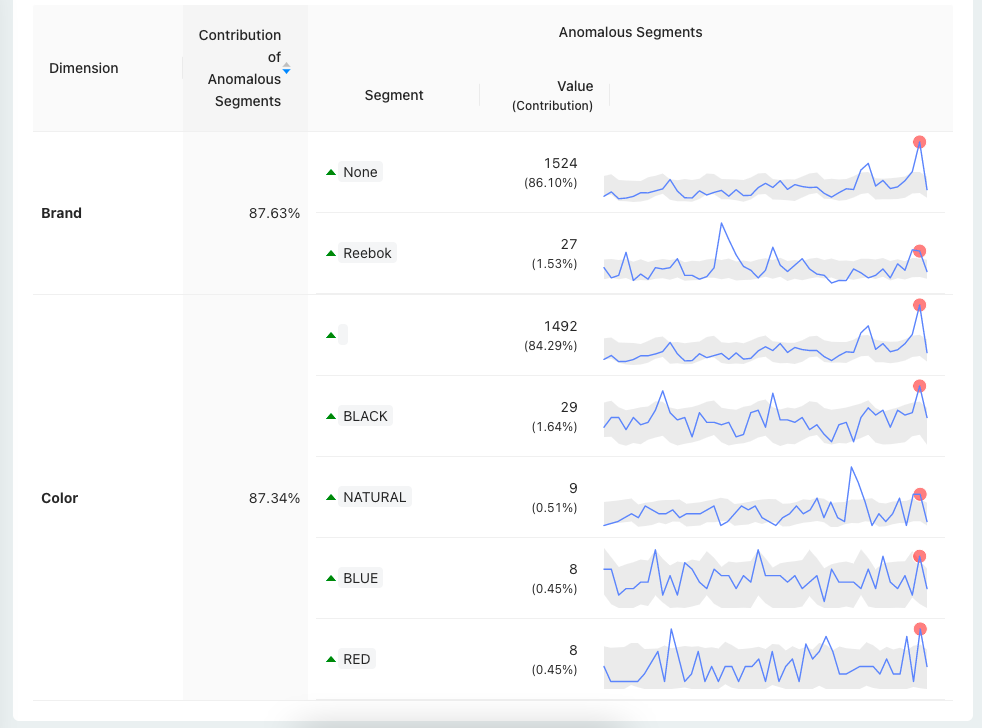

# Root Cause Analysis

To do root cause analysis on an anomaly card, click the `Analyze` button in the RCA section below the anomaly card.

CueObserve picks the latest anomalous data point as the parent anomaly. It then starts looking for child anomalies across all other dimensions in the dataset.

Say you an anomaly card \(below\) where Orders measure for state = TX had an anomaly on 2021-08-15. The actual number of orders was 1770, which was 45% higher than the expected value. When I click the `Analyze` button, CueObserve starts analyzing the dataset.

It takes _{measure = Orders, state = TX, period = 2021-08-15}_ as the parent anomaly. It starts slicing the data across other dimensions in the dataset. It is looking for child anomalies for the same period.

The orders dataset has 2 additional dimensions - _Brand_ and _Color_. It splits the data across each of these dimensions. If a child anomaly is detected, it populates the results as a table.

## How to read RCA results table

In the RCA results table, each child anomaly appears as a row. 

In the example above, the anomalous segment of _Brand = None_ is equivalent to the dataset filter of _\(state = TX and Brand = None\)_.

The contribution percentages displayed are with respect to the parent anomaly. Remember the parent anomaly had Orders as 1770.

## How RCA works

Under the hood, CueObserve does the following:

It takes the latest anomalous data point from the card. The anomalous data point is defined by its \(X, Y\) values:

* X value: time period
* Y value: measure for a dimension value. e.g. Orders where state = TX

It applies the dimension value filter on the original dataset.

It then runs anomaly detection jobs on every other dimension in this filtered dataset. It splits the filtered dataset by each dimension. It inherits the split limit from the original anomaly definition. If the original anomaly definition doesn't have a split, it limits the split to dimension values that have a minimum contribution of 1% to the filtered measure value.

